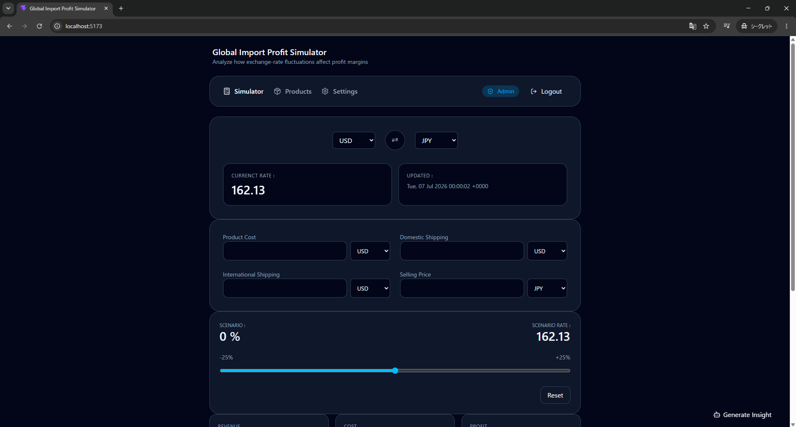
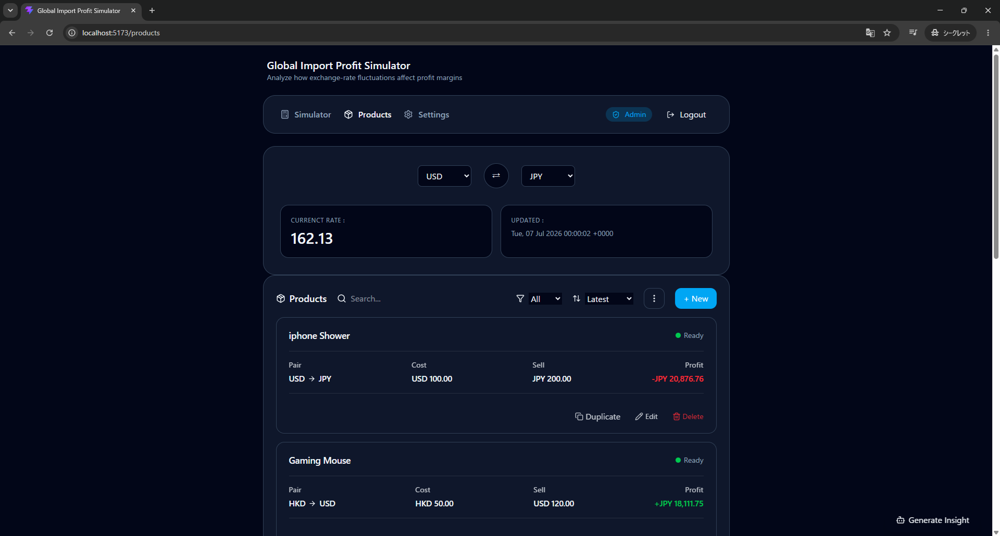
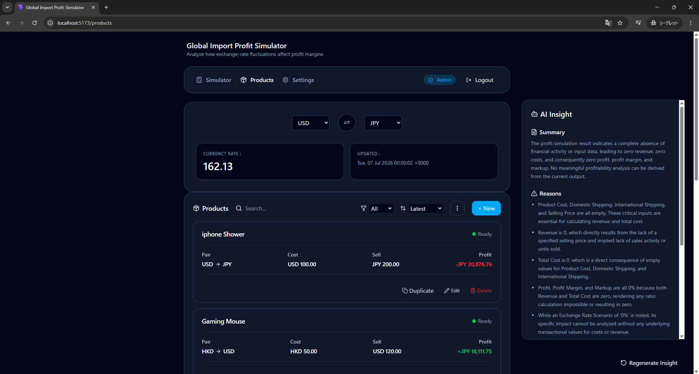
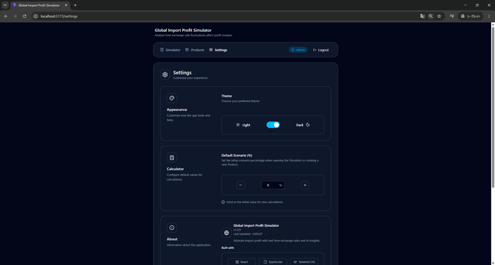
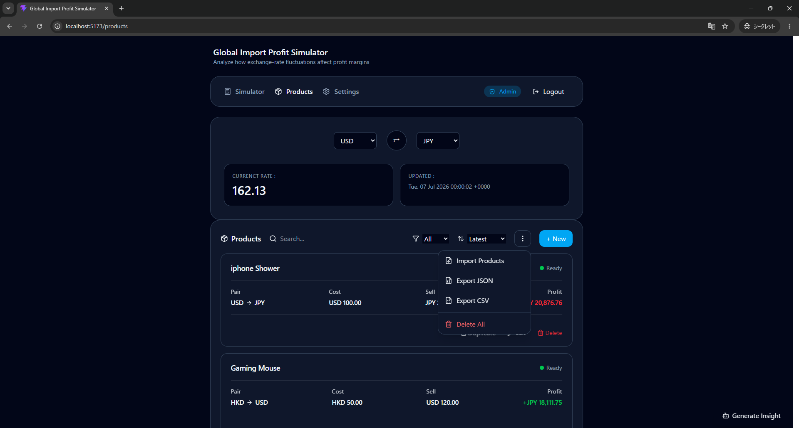

# 📈 Global Import Profit Simulator

> A production-ready frontend architecture demonstrating complex financial business logic, scalable state management, and AI-assisted insights without backend dependencies.

✨ Live Exchange Rates  
📦 Product Management  
🤖 AI Profit Insight  
📊 Scenario Simulation  
💾 Import / Export  
⚙️ Persistent Settings

🔗 Live Demo: https://jillchiu.github.io/react-global-import-profit-simulator/

📂 Source Code: https://github.com/jillchiu/global-import-profit-simulator

## 🎯 Project Vision & Why I Built This

In international trade and cross-border transactions, fluctuating exchange rates constantly threaten profit margins. I built this application to model these real-world financial complexities while showcasing a modern, maintainable React architecture.

Instead of maximizing a feature set, the focus is strictly on **scalable state management, separation of concerns, and type-safe financial calculations**. It demonstrates how to effectively isolate business logic from UI components, integrating AI as a resilient, optional enhancement.

## ⭐ Key Highlights

* ⚡ Feature-based React architecture
* 📦 Full CRUD product management
* 📊 Profit simulation under exchange-rate scenarios
* 🤖 AI-powered business insights (Gemini)
* 💾 JSON import / export
* 📄 CSV profitability reports
* 🎨 Persistent themes & settings

## 📸 Screenshots

### Simulator



### Product Management



### AI Insight



### Settings



### Product Actions



## ✨ Features

### Exchange Rate Dashboard

Displays:

* Live exchange rates
* Base / target currency selection
* Currency swapping
* Last updated timestamp

### Profit Calculator

Calculate:

* Product Cost
* Domestic Shipping
* International Shipping
* Revenue
* Total Cost
* Profit
* Margin
* Markup

### Scenario Simulation

Simulate exchange-rate movement from:
```text
-25% → +25%
```
Shows

* Scenario exchange rate
* Profit impact
* Margin impact

### Interactive Chart

Visualizes:

* Profit trend
* Margin trend

across different exchange-rate scenarios.

using Recharts.

### Product Management

Manage multiple import products with:

* Create
* Edit
* Delete
* Duplicate
* Search
* Filter
* Sort
* Draft / Ready status

### Data Import & Export

Supports:

* Import products from JSON
* Export products as JSON
* Export profitability reports as CSV

### AI Profit Insight

Generate AI-powered business insights using Gemini API.

Features:

* Natural language business summary
* Profitability analysis
* Cost observations
* Risk suggestions
* Exchange-rate commentary

### Application Experience

* Dark / Light mode
* Persistent settings
* Theme persistence
* Toast notifications
* Confirmation dialogs
* Responsive layout

### Admin

* Full CRUD
* Import Products
* Delete Products
* Settings Modification

### Viewer

* View Products
* Run Calculations
* Export Reports

## 👥 Role-Based Access Control (Demo)

To easily evaluate the application from different user perspectives, a password-less role selection screen is presented upon launch. 

While the routing structure remains consistent across the app, **Component-Level Authorization** is implemented to dynamically render UI elements and restrict actions based on the active role.

* **Admin:** Full CRUD access. Can create, edit, duplicate, and delete products, as well as modify global settings.
* **Viewer:** Read-only access. Can view products, run profit simulations, and export reports. All mutation actions (buttons, forms, and destructive actions) are safely hidden or disabled.

> 💡 **Tip:** The active role is always displayed in the navigation bar, where you can log out at any time to switch roles.

## 🛠 Challenges & Solutions

### Context Separation

Problem

Business state became difficult to maintain as more features were added.

Solution

* Separated the application into dedicated Context Providers (Exchange, Product, Calculator, Settings, Auth), allowing each feature to own its own state while keeping pages focused on orchestration.

### Product Action Layer

Problem

CRUD logic was becoming duplicated across components.

Solution

* Introduced dedicated Action Hooks that coordinate Providers, business logic, confirmation dialogs, persistence, and toast notifications while keeping UI components focused on rendering.

### Exchange Rate Caching

Problem:

Repeated API requests were wasting quota and slowing reloads.

Solution:

* Implemented LocalStorage caching and reused exchange-rate data until the provider update window expired.

### Scenario Simulation Performance

Problem:

Profit calculations needed to update continuously while moving the slider.

Solution:

* All scenario calculations are performed locally without additional API requests.

### Currency Pair Synchronization

Problem:

Users frequently changed base and target currencies, creating inconsistent form values.

Solution:

* Currency selections inside the calculator automatically synchronize with the selected currency pair.

### AI Integration

Problem

AI responses are unpredictable and expensive.

Solution

* Implemented typed AI responses, loading overlays, request cancellation, and centralized error handling while keeping AI completely optional.

## 🧠 Architecture

The project separates:

```text
Pages
    ↓
Components
    ↓
Action Hooks
    ↓
Context Providers
    ↓
Business Logic
    ↓
API Layer
    ↓
Storage
```

This layered architecture keeps UI rendering, business logic, state management, and external communication independent, making the application easier to maintain and extend.

## 🔄 Data Flow

```text
Exchange API
      ↓
Exchange Provider
      ↓
Calculator Provider
      ↓
Product Actions
      ↓
Product Provider
      ↓
UI Components
```

Exchange-rate data is fetched once, cached locally, and reused throughout the application.

All profitability calculations are performed on the client side to provide instant feedback without additional API requests.

## ⚙️ Technical Highlights

### Type-Safe Business Logic

Financial calculations are fully typed using TypeScript.

Benefits:

* Safer refactoring
* Better editor support
* Reduced runtime errors

### Scenario-Based Simulation

Users can simulate exchange-rate movement from:

```text
-25% → +25%
```

and immediately see the impact on:

* Profit
* Margin
* Markup

### Centralized Theme System

Dark and Light themes are managed through a shared theme configuration object.

Benefits:

* Consistent styling
* Easier maintenance
* Simplified future expansion

### Context-Based Architecture

Business logic is separated into dedicated Context Providers.

Examples:

* Exchange Provider
* Product Provider
* Calculator Provider
* Setting Provider

### Action Layer

Complex workflows are isolated inside reusable action hooks instead of UI components.

Benefits:

* Cleaner pages
* Better maintainability
* Easier testing

## Design Principles

The project follows several principles:

* Separation of concerns
* Single responsibility
* Feature-based architecture
* Reusable UI components
* Type-safe domain models
* Business logic independent from UI

## 🚀 Getting Started

```bash
npm install
npm run dev
```

## 📦 Production Build

```bash
npm run build
npm run preview
```

## 🔑 Environment Variables

Gemini API is optional. The application works without AI features when the key is omitted.

Create a `.env` file:

```env
VITE_EXCHANGE_API_KEY=your_api_key
VITE_GEMINI_API_KEY=your_api_key
```

## 🧩 Project Structure

```text
src/
└─ features/
    ├─ ai/
    ├─ api/
    ├─ components/
    ├─ config/
    ├─ context/
    ├─ core/
    ├─ data/
    ├─ hooks/
    ├─ mappers/
    ├─ model/
    ├─ pages/
    ├─ profit/
    ├─ providers/
    ├─ reducers/
    ├─ router/
    ├─ shared/
    ├─ theme/
    └─ utils/
```

### ai

Contains AI prompt builders, response processing, and Gemini integration logic.

### api

Handles communication with external APIs such as ExchangeRate API and Gemini API.

### components

Reusable UI components shared across multiple pages.

Examples:

* ProductCard
* ExchangeRatePanel
* ProfitSummary
* ToastMessage

### config

Application-wide configuration and constant data.

Examples:

* Supported currencies
* Theme presets
* Technology stack definitions

### context

Defines all React Context objects used throughout the application.

Contexts only expose shared interfaces.
Providers implement the business logic.

Examples:

* AuthContext
* ProductContext
* ExchangeContext
* CalculatorContext
* ThemeContext

### core

Core business services shared across multiple features.

Examples:

* Request orchestration
* Exchange service
* AI service

### data

Static application data used for demos or initialization.

### hooks

Custom React hooks responsible for feature logic and workflow orchestration.

Examples:

* useExchange
* useCalculator
* useProductActions
* useTheme

### mappers

Transforms raw API responses into strongly typed application models.

### model

TypeScript types, interfaces, enums, and domain models.

### pages

Top-level route components responsible only for page composition.

Business logic is delegated to Providers, Hooks, and Components.

### profit

Domain-specific profitability calculations and scenario generation.

Examples:

* Current profit calculation
* Scenario profit simulation

### providers

Implements the logic behind each Context and manages application-wide business state.

Responsibilities:

* Coordinate reducers
* Persistence
* Feature actions
* Business logic

### reducers

Reducer functions used to manage complex state transitions.

### router

Application routing configuration.

### shared

Reusable types and constants shared across multiple features.

### theme

Application theme definitions for Light / Dark mode.

### utils

Framework-independent helper functions.

Examples:

* Currency conversion
* LocalStorage helpers
* CSV / JSON export
* Profit calculation
* Formatting
* Chart generation

## 🧩 Folder Philosophy

The project follows a feature-based architecture with clear separation of responsibilities.

Rather than organizing files by file type alone, each layer focuses on a single responsibility:

* Pages orchestrate features and compose layouts.
* Components provide pure presentation without business logic.
* Hooks expose reusable feature workflows built on top of Providers.
* Contexts define shared application interfaces.
* Providers own feature state and expose it through Context.
* Core and API layers isolate external communication.
* Utility modules stay framework-independent and reusable.

This separation minimizes coupling between UI, business logic, and data access, making the application easier to maintain, test, and extend.

## 🎨 Design Decisions

### Exchange Rate Caching

Exchange-rate responses are cached in LocalStorage and reused until the API update window expires.

Benefits:

* Reduced API usage
* Faster startup time
* Better reliability

### Business Logic Isolation

Financial calculations are isolated from UI components.

Benefits:

* Easier testing
* Better maintainability
* Cleaner component structure

### Local Scenario Calculation

Scenario simulations are calculated entirely on the client.

Benefits:

* Instant feedback
* No extra network requests
* Better user experience

### Product Persistence

Products are stored locally using LocalStorage.

Benefits:

* Offline availability
* Fast loading
* No backend required

### Context Providers

Each feature owns an independent provider, reducing unnecessary coupling between unrelated business logic.

## 🧱 Tech Stack

### Frontend

* React
* TypeScript
* Vite
* Tailwind CSS

### UI

* Radix UI
* Lucide React

### Visualization

* Recharts

### AI Integration

* Gemini API

### Data

* ExchangeRate API

### Storage

* LocalStorage

### Tooling

* ESLint
* TypeScript Strict Mode

### State Management

* React Context
* useReducer

## 🧪 Future Improvements

* JWT Authentication
* Backend synchronization
* Cloud persistence
* Historical exchange-rate charts
* Multi-user workspace
* AI product comparison

## 🎯 Portfolio Objectives

This project demonstrates production-oriented React application architecture, including:

* React + TypeScript architecture
* Context Provider separation
* State management
* CRUD workflow
* Business logic isolation
* Financial calculation modeling
* API integration
* AI integration (Gemini)
* Local persistence
* Import / Export workflow
* Error handling
* User permission handling
* Responsive UI design
* Feature-based project organization
* Reusable component design
* Context-driven application architecture

Rather than maximizing feature count, the project focuses on scalable frontend architecture and maintainable business logic.
